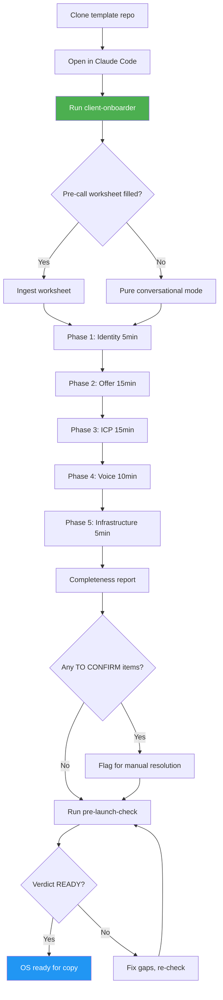
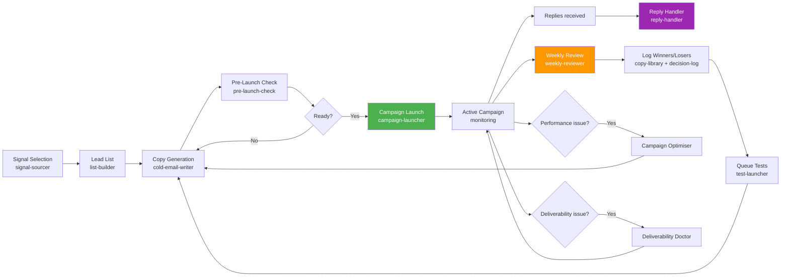
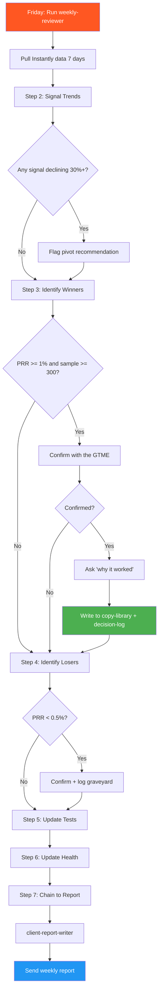
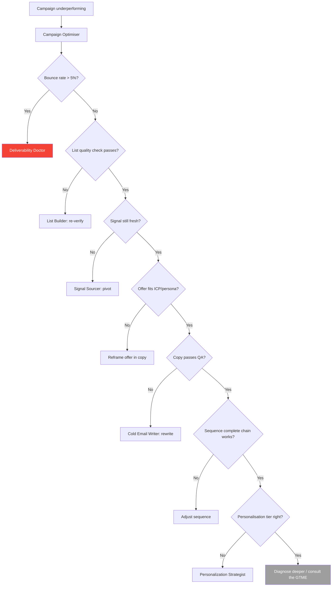
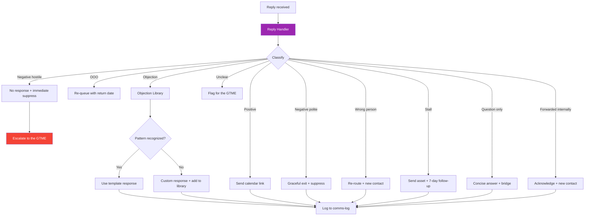
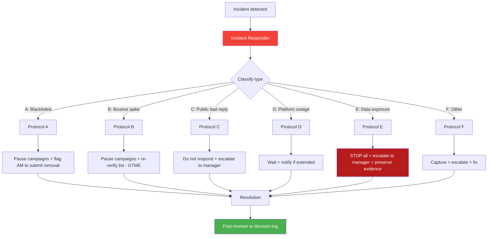

# Visual Diagrams

Mermaid flowcharts of the core OS workflows. Open this file in any markdown viewer that supports Mermaid (GitHub, VS Code, Obsidian) to see the rendered diagrams.

---

## 1. Onboarding Flow (Client Onboarder)



---

## 2. Campaign Lifecycle



---

## 3. Weekly Review Flow (Friday Compounding Loop)



---

## 4. Optimisation Decision Tree



---

## 5. Reply Handling Flow



---

## 6. Incident Response Flow



---

## 7. Operating Rhythm (Daily/Weekly/Quarterly)

```mermaid
gantt
    title Operating Rhythm Across the Week
    dateFormat HH:mm
    axisFormat %H:%M

    section Daily
    Morning check 10min     :09:00, 10m
    Reply triage             :09:10, 20m
    End of day wrap 5min    :17:30, 5m

    section Monday Only
    Portfolio health 1hr     :10:00, 60m

    section Friday Only
    Weekly review (per client)  :14:00, 180m
    Send weekly reports       :17:00, 30m

    section Monthly
    ICP / offer review (per client)  :09:00, 30m

    section Quarterly
    QBR prep + call (per client) :09:00, 120m
```



---

## 8. File Architecture

```mermaid
flowchart TD
    A[Client OS Repo] --> B[Per-client files<br/>clients/{slug}/]
    A --> C[Shared knowledge<br/>wiki/]
    A --> D[AI skills<br/>gtm-skills/]
    A --> E[Infrastructure<br/>README, BOOTSTRAP, VERSION]

    B --> B1[_config.md]
    B --> B2[overview.md]
    B --> B3[icp.md]
    B --> B4[offer.md]
    B --> B5[voice.md]
    B --> B6[campaign-state.md]
    B --> B7[decision-log.md]
    B --> B8[comms-log.md]
    B --> B9[competitive-intel.md]
    B --> B10[copy-library.md]
    B --> B11[test-log.md]

    C --> C1[_skill-context.md]
    C --> C2[copywriting-101.md]
    C --> C3[signal-sourcing.md]
    C --> C4[deliverability.md]
    C --> C5[...]

    D --> D1[client-onboarder.md]
    D --> D2[weekly-reviewer.md]
    D --> D3[reply-handler.md]
    D --> D4[...]

    style B fill:#FF9800,color:#fff
    style C fill:#4CAF50,color:#fff
    style D fill:#2196F3,color:#fff
```

---

## How to Use These Diagrams

- **Onboarding:** show diagram #1 to a new collaborator
- **Pitching the OS:** show diagram #2 to a prospect or stakeholder
- **Training Claude:** these diagrams give Claude visual context for the workflows it operates
- **Documentation:** when updating workflows, update the corresponding diagram